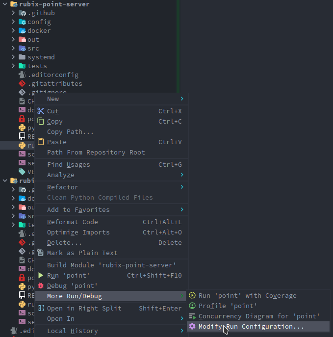
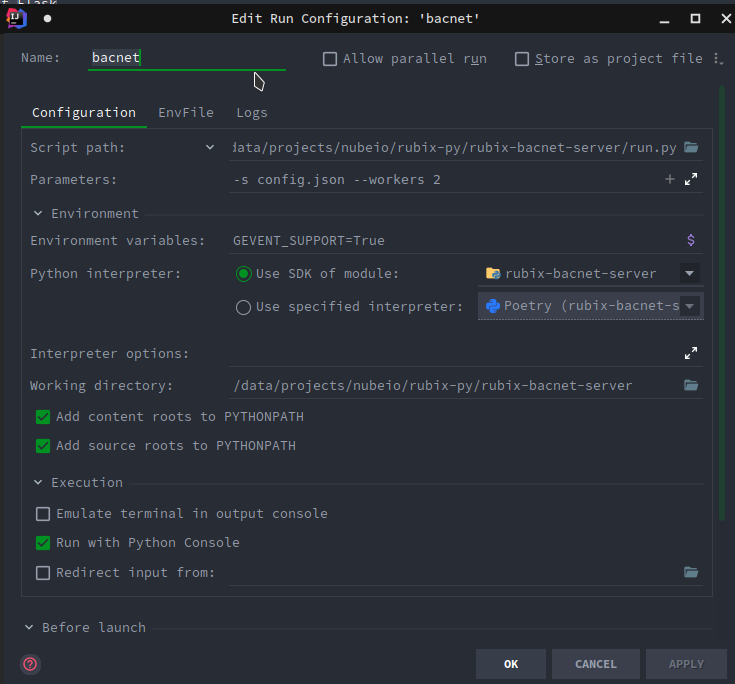

# Rubix Python

## Development setup

- Use [`poetry`](https://github.com/python-poetry/poetry) to manage dependencies
- Install `poetry` tool

  ```bash
  ./setup.sh
  ```

- Setup dependencies in existing project

  ```bash
  poetry install
  ```

- Add new dependencies in existing project

  ```bash
  poetry add flask panda
  ```

- Join `venv`

  ```bash
  poetry shell
  ```

- Run after join `venv`

  ```bash
  $ python run.py -h
  Usage: run.py [OPTIONS]
  
  Options:
    -p, --port INTEGER              Port  [default: 1717]
    -d, --data-dir PATH             Application data dir
    --prod                          Production mode
    -s, --setting-file TEXT         Rubix BACnet: setting ini file
    -l, --logging-conf TEXT         Rubix BACnet: logging config file
    --workers INTEGER               Gunicorn: The number of worker processes for handling requests.
    -c, --gunicorn-config TEXT      Gunicorn: config file(gunicorn.conf.py)
    --log-level [FATAL|ERROR|WARN|INFO|DEBUG]
                                    Logging level
    -h, --help                      Show this message and exit.
  ```

- Build local binary

  ```bash
  poetry run pyinstaller run.py -n <project_name> --clean --onefile --add-data VERSION:VERSION
  ```

The output is: `dist/<project_name>`. Project name should be in `pyproject.toml`

### Integrate with IDE

#### `PyCharm` or `Intellij Ultimate`

- Right click in each `run.py`

  

- Modify `name`, `parameter`, `Environment variables` in popup
  - `Parameters`: `-s config.json --workers 2` (other parameters will be depended on each specific project)
  - `Environment variables`: `GEVENT_SUPPORT=True`

  

- In project directory, make a copy `./config/config.example.json` to `./out/config.json`

- Then `run` or `debug` as image

  

  


## Development note

### Python module:


- Expose only needed `function`, `class` for another file in `module` level.
- For using in `module` level, use `intra-package references`.

Reference:

- [import python docs](https://docs.python.org/3/tutorial/modules.html#importing-from-a-package)
- [intra package docs](https://docs.python.org/3/tutorial/modules.html#intra-package-references)

Example [here](https://github.com/NubeIO/rubix-point-server/blob/6c479547df659b139ff88dd2d8949f36e39be493/src/__init__.py#L1-L5):

```python 
from .app import create_app, db 
from .background import FlaskThread 
from .event_dispatcher import EventDispatcher 
from .server import GunicornFlaskApplication 
from .setting import AppSetting, ServiceSetting, DriverSetting, MqttSetting, InfluxSetting, GenericListenerSetting
```

### Use `Singleton` pattern

```python
class Singleton(type):
  _instances = {}


def __call__(cls, *args, **kwargs):
  if cls not in cls._instances:
    cls._instances[cls] = super(Singleton, cls).__call__(*args, **kwargs)
  return cls._instances[cls]


class DeviceRegistry(metaclass=Singleton):
  pass
```

### Class attribute

Don't use class attributes and class method level in order to avoid unexpected behaviors.

- An instance attribute is a Python variable belonging to one, and only one, object. This variable is only accessible in
  the scope of this object and it is defined inside the constructor function, `__init__(self,..)` of the class.
- A class attribute is a Python variable that belongs to a class rather than a particular object. It is shared between
  all the objects of this class and it is defined outside the constructor function, `__init__(self,...)`, of the class.
  
Example: https://github.com/NubeIO/rubix-point-server/compare/dev#diff-b352f9e685d68e2028ada02b2190f5cb3c9c6ae12b351f9b318c002317af7facR46-R50

### Use `logger` format from `gunicorn`

- To maintain consistency and readability.
- Don't init `logger` too early in file level.

Instead

```python
import logging

logger = logging.getLogger(__name__)
```

Should use

```python
from logging import Logger
from flask import current_app
from werkzeug.local import LocalProxy


class Object:
  def __init__(self):
    self.logger = LocalProxy(lambda: current_app.logger) or Logger(__name__)
```

### Use FlaskThread

```python
class FlaskThread(Thread):
    """
    To make every new thread behinds Flask app context.
    Maybe using another lightweight solution but richer: APScheduler <https://github.com/agronholm/apscheduler>
    """

    def __init__(self, *args, **kwargs):
        super().__init__(*args, **kwargs)
        self.app = current_app._get_current_object()

    def run(self):
        with self.app.app_context():
            super().run()
```
